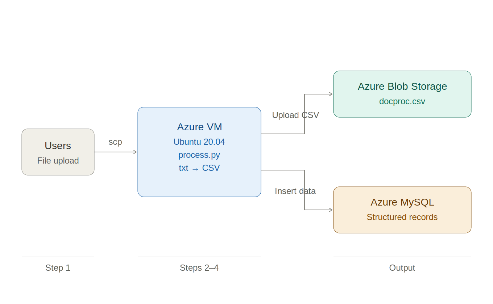

# ⚙️ Automated Event-Driven Data Pipeline on Azure

-4479A1?logo=mysql&logoColor=white)

## 📌 Project Overview

This project implements an **event-driven data processing pipeline on Microsoft Azure** that automates data ingestion, transformation, storage, and persistence.

The system processes raw input files using a Python-based automation engine, converts them into structured CSV format, stores them in Azure Blob Storage, and persists structured data into a **self-managed MySQL database hosted on an Azure Virtual Machine**, enabling an end-to-end automated data workflow.

---

## 📐 Architecture Overview

The system follows a simple ETL-style cloud architecture:

Users upload raw data → Azure VM processes data → CSV stored in Blob Storage → structured data stored in MySQL (VM-based)

Refer to the architecture diagram below for visual representation.

### High-Level Workflow

- Raw input file is processed using a Python automation script  
- Data is transformed into structured CSV format  
- CSV file is uploaded to Azure Blob Storage for persistent storage  
- Structured data is inserted into MySQL database hosted on an Azure VM (self-managed)  
- Entire pipeline runs in an automated execution flow on an Azure Ubuntu VM  

---

## 🛠️ Azure Services Used

| Layer | Technology |
|------|------------|
| Compute | Azure Virtual Machine (Ubuntu) |
| Storage | Azure Blob Storage |
| Database | MySQL hosted on Azure VM (Self-Managed) |
| Integration | Azure SDK for Python |
| Runtime | Python 3.10+ |

---

## ⚙️ Pipeline Design

Raw Input File  
    ↓  

Python Processing Engine  
    ↓  

CSV Transformation Layer  
    ↓  

Azure Blob Storage  
    ↓  

MySQL Database
---

## 🔐 Key Features

- Automated data ingestion and transformation pipeline  
- Cloud-native storage integration using Azure Blob Storage  
- Self-managed MySQL database deployment on Azure VM  
- Modular Python automation engine  
- End-to-end execution with no manual intervention after trigger  
- Clear separation between raw data storage and structured database layer  

---

## 🔒 Design Considerations

- **Data separation:** Raw files stored in Blob Storage, structured data stored in MySQL VM  
- **Infrastructure control:** Full control over database configuration via VM-based deployment  
- **Security:** Database access restricted via private networking and controlled VM access  
- **Extensibility:** Can be extended to event-driven serverless architecture using Azure Functions  

---

## 💡 Key Learnings

- Designing cloud-based ETL-style pipelines on Azure  
- Managing infrastructure-level database deployment (MySQL on VM)  
- Integrating Azure Blob Storage with compute workloads  
- Python-based automation using Azure SDK  
- Understanding end-to-end cloud data flow architecture  
- Building modular and scalable cloud automation systems  

---

## 🚀 Future Enhancements

- Convert VM-based execution into Azure Functions (serverless architecture)  
- Introduce event-driven triggers using Azure Event Grid  
- Implement CI/CD pipeline for automated deployment  
- Add centralized monitoring using Azure Monitor and Log Analytics  
